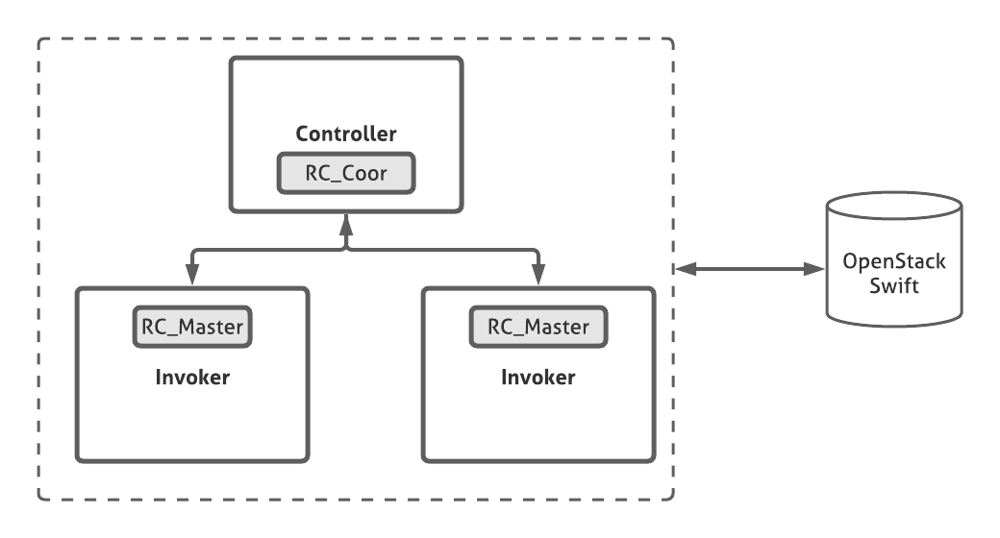

# FAASCACHE
FaaSCache, is a transparent, vertically and horizontally elastic in-memory caching system for Function as a Service platforms. The cache is distributed over worker nodes to mitigate the overheads of frequent interactions with an external data store, as required by the stateless FaaS paradigm. FaaSCache is based on enhancements to the Apache OpenWhisk FaaS platform, the OpenStack Swift persistent object storage service, and the RAMCloud in-memory store.

## Folders description

* **customRuntime** contains our custom Openwhisk image that embeds the proxy and write-back routines.

* **datasets** contains the datasets used for our multimedia and audio processing functions.

* **faasLoad** contains the source code our custom load injector for OpenWhisk, which allows emulating several tenants with different workloads.

* **functions** contains the source code of a set of single and pipeline functions.

* **IMOC** embeds the custom Ramcloud, OpenWhisk-core and OpenStackSwift used for FAASCache.

## Building

The current version of FAASCACHE relies on three components, OpenWhisk, RAMCloud, and OpenStackSwift. Below, we show how to deploy these components and connect them.

### Prerequisites
**Openjdk >=** 8; **Gradle >=** 5.0.0; **gcc ==** 5.4, 4.8; **Docker**


### Building OpenWhisk-core
The first step is building our custom version of openwhisk-core. It is the central part of the OpenWhisk since it embeds logic to store, launch, schedule, and report user functions. We customized it to introduce our scheduling enhancements, a scala library to communicate with RAMCloud controller nodes, and a scala integration of our machine learning routines to predicts function memory usage. It is relatively easy to build:

```bash
git clone https://github.com/djobiii2078/FAASCACHE.git   
cd IMOC/openwhisk-core/
./gradlew :core:standalone:build
```

If everything went right, there should be a **openwhisk.jar** created in *IMOC/openwhisk-core/bin* folder. 
Now, you should create an image docker based on our previous build. It is recommended to save the image on Docker Hub but it can work with a locally built image.

**Locally openwhisk docker image**

```bash
./gradlew :core:standalone:distDocker
```

**Or save the image on your Docker Hub**

```bash
docker login #enter your credentials
./gradlew :core:standalone:distDocker
```

In both cases, you will see `whisk/standalone` in your docker image list (**docker images**).

### Building RAMCloud 
We use RAMCloud as our object caching system. RAMCloud is a RAM-based durable key-value store. We customized RAMCloud to introduce autoscaling, persistence, and consistency routines. The following steps describe how you can build our custom-based RAMCloud:

```bash
cd IMOC/RAMCloud/
chmod +x install.sh
./install.sh
```

## Deploying FAASCACHE
As shown on the figure below, a minimal FAASCACHE deployment includes an openwhisk controller and a RAMCloud coordinator on the same node, two openwhisk invoker nodes, and an OpenStackSwift node. On each openwhisk invoker node runs a RAMCloud server instance.   
 



Let's consider this table for the next steps:
| **@owk_contr**| IP Adress of the node for the RAMCloud coordinator    	| 
|-------------- |:-------------------------------------------------------------:| 
|**@invoker1**  | IP Adress of the node for the first openwhisk invoker 	| 
|**@invoker2**  | IP Adress of the node for the second openwhisk controller     |
| **@swift**    | IP Adress of the node for OpenStack Swift   			|   
	

**Starting the RAMCloud cluster**

First, [build RAMCloud](https://github.com/djobiii2078/FAASCACHE#building-ramcloud) on each RAMCloud node (coordinator and invoker nodes).

On the RAMCloud controller node, start a RAMCloud controller instance 

```bash
RAMCloud/obj.master/coordinator -C tcp:host=`hostname -s`,port=11100 -x \
	zk:localhost:2181
```


On each RAMCloud invoker node, start a RAMCloud master instance:

```bash
RAMCloud/obj.master/server -L tcp:host=`hostname -s`,port=1101 -x \
	zk:@owk_contr:2181 --totalMasterMemory 4096 -f \
		~/backup --segmentFrames 1500 -r 1 --allowLocalBackup
```

This creates an instance of a RAMCloud coordinator which can use up to 4GB of memory to cache objects. For more details on this command inputs, please checkout the official RAMCloud documentation page. 

**Deploying OpenWhisk cluster kubernetes mode**

The steps are the same as [native OpenWhisk](https://github.com/apache/openwhisk#deploy-to-kubernetes). However, you must use our update version in *IMOC/openwhisk-cluster-mode*. Don't forget to update your **.yaml** to update the image of the openwhisk-core used. 

> Use "whisk/controller" for a local image however, if your image is on a Docker Hub, you will need to update the **imageName** tag. 

```yaml
controller:
 imageName: "whisk/controller"
 imageTag: "latest"
```
> @invoker1 and @invoker2 must correspond to the node where the RAMCloud master's are deployed.
	 
**Deploying OpenStackSwift and associated modules**
Deploying OpenStackSwift is straightforward. Follow step by step, the instructions in [custom swift setup](https://github.com/djobiii2078/FAASCACHE/tree/main/IMOC/OpenStackSwift#overview)

**Wrapping up**

To finish the setup, we will install custom utility FAAS functions.

## Tests
